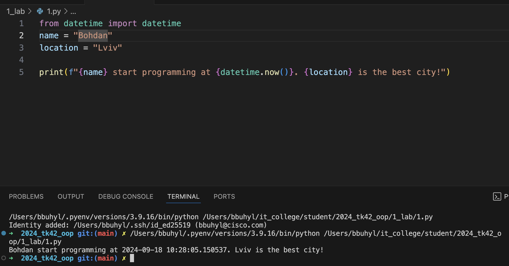
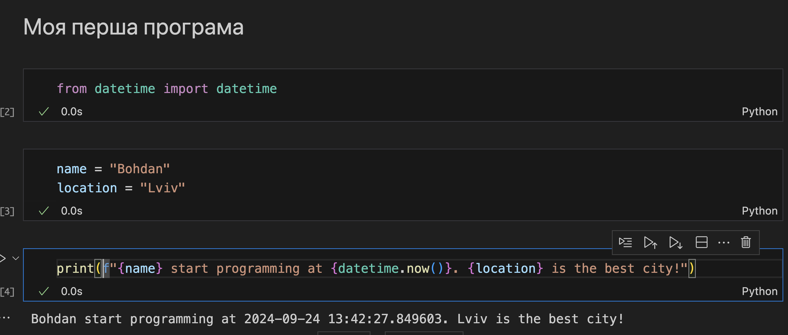

# Звіт до роботи №1
## Тема: _Вступ, налаштування середовища_
### Мета роботи: _Налаштувати середовище виконання робіт, встановити потрібно програми, створити репозиторій на Github, навитись працювати з репозиторієм та оформити звіт до роботи за допомогою форматування Markdown_

---
### Виконання роботи
* Результати виконання завдань:
    1. Скачали програми та інсталювали на ПК;
    1. Створили репозиторій на GitHub;
    1. Налаштували Visual Studio Code з Github;
    1. Заповнили початкову сторінку за допомогою ChatGPT;
    1. Скопіював код програми та змінив змінні згідно завдання, програма знаходиться у файлі [1.py](1.py)
    1. Програма вивела значення показані на скріншоті
    
    1. Стоворили [Пайтон Ноутбук](1.ipynb), та виконали код у комірці Пайтон.
    1. Отримано наступні результати які показані на скріншоті
    
    1. Навчились працювати з Пайтон та МаркДайн

---
### Висновок:
> у висновку потрібно відповісти на запитання:

- :question: Що зроблено в роботі;
- :question: Чи досягнуто мети роботи;
- :question: Які нові знання отримано;
- :question: Чи вдалось відповісти на всі питання задані в ході роботи;
- :question: Чи вдалося виконати всі завдання;
- :question: Чи виникли складності у виконанні завдання;
- :question: Чи подобається такий формат здачі роботи (Feedback);
- :question: Побажання для покращення (Suggestions);

---